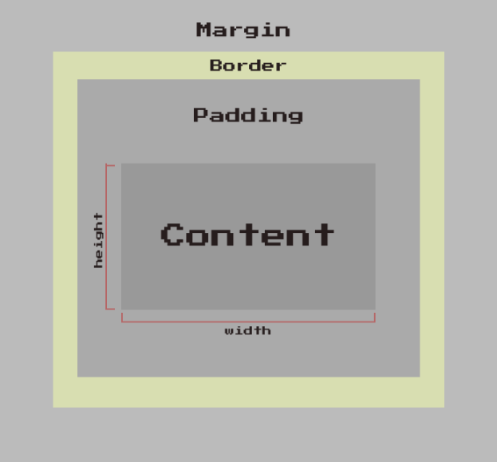
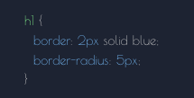

# Practice: Creating a Webpage building upon HTML basics and understanding how to use CSS

## Understanding selectors and properties to bring styling with colors, fonts, sizing, layouts, and much more...

### Practce understanding CSS -> The Border Box

-   [ ] Simple practice to gain a better understanding of the power of adding CSS Styling to a webpage and how it can make it uniquely beautiful
    -   [ ] CSS or Cascading Style Sheet, is a language that paints a website with colors, fonts, layouts, and animations.
    -   [ ] CSS is used to create stunning webpages.
    -   [ ] It can enhance the user experience, and can make a webpage unquie and stand out amongst the rest.
    -   [ ] It is absolutely beautiful to see a webpage come to life and become even more beautiful.

-   [ ] CSS - The Box Model:
    -   [ ] "The Box Model" descibres how an element handles its content and the space around it
    -   [ ] Every element is made of four box layers in the following order, from the innermost to the outermost:
        -   [ ] A "content box" for things like text and images
        -   [ ] A "padding box" of space aroung the content
        -   [ ] A "border box" that goes around the padding
        -   [ ] A "margin box" of empty space that surrounds the whole element

-   [ ] CSS - The Border Box:
    -   [ ] Most elements have a border and to make these borders visible is to add a border to elements using the CSS "border" property:
        -   [ ] 
    -   [ ] The "border" property is actually a shorthand that combines the values of multiple properties into one ddeclaration:
        -   [ ] 
        -   [ ] "border-width" determines the "thickness" of the border, and is usually set with absolute unites (i.e. pixels)
        -   [ ] "border-style" includes values like "solid", "dashed", "dotted"
        -   [ ] "border-color" can be set with a named color, an rgb() value, or a hexadecimal
    -   [ ] A common-practice for borders is rounding the corners using the "border-radius" property:
        -   [ ] 
        -   [ ] Both absolute and relative units can be used. The larger the value, the rounder the corner will be

-   [ ] The &lt;header&gt; element:
    -   [ ] Is used for the beginning of the webpage
    -   [ ] Houses the title of the webpage along with Logos
    -   [ ] The &lt;img&gt; element:
        -   [ ] Is used for all the images on the webpage

-   [ ] The &lt;nav&gt; element:
    -   [ ] This element tends to contain ordered lists, unordered lists, or even both types of lists
    -   [ ] Each &lt;li&gt; element will house an &lt;a&gt; elements with the #id-name of the desired section or part of the webpage it will be linked within the "href" attribute
        -   [ ] For instance:
            -   [ ] &lt;a href="#desired-section"&gt;🌸 Desired Section🌸&lt;/a&gt;
            -   [ ] <a href="#desired-section">🌸 Desired Section 🌸</a>
            -   [ ] When the user would click the 🌸 Desired Section 🌸 link they would then be navigated to that section of the webpage

-   [ ] The &lt;br&gt; element:
    -   [ ] Creates a new line in your code and forces whatever comes after to start on a new lin

-   [ ] The &lt;hr&gt; element:
    -   [ ] Adds a horizontal line or dividing line across the webpage
    -   [ ] Used to separate sections or different topics on a webpage

-   [ ] The &lt;main&gt; element:
    -   [ ] Is where the main information of the webpage will go
    -   [ ] The &lt;section&gt; element:
        -   [ ] This groups together pieces of similar information

-   [ ]  The &lt;footer&gt; element:
    -   [ ]  This element tends to finish off the webpage as it is located at the very bottom of the webpage and is the last set of items that will be seen
    -   [ ] For instance:
        -   [ ] A footnote on the webpage
        -   [ ] Links to different sections of the webpage
        -   [ ] A copyright symbol for copyright information
            -   [ ] & copy; -> is the symbol for copyright
        -   [ ] A link to external sources using the "href" attribute of the &lt;a&gt; element for the links in the list item to external sources
            -   [ ] &lt;a href="/privacy"&gt;Privacy&lt;/a&gt;
                -   [ ] Use the target attribute to open the link path in a new tab instead of the current page
                -   [ ] <a href="/privacy" target="_blank">Privacy</a>
                -   [ ] When the user clicks one of these external links, they would be redirected to a new page with the informat ion

-   [ ] Encompass:
    -   [ ] HTML
    -   [ ] CSS
-   [ ] HTML:
    -   [ ] Will be the structure and skeleton of how the app will appear on the webpageWill be the structure and skeleton of how the app will appear on the webpage
-   [ ] CSS:
    -   [ ] Encompass the style of the app and give it some flair
